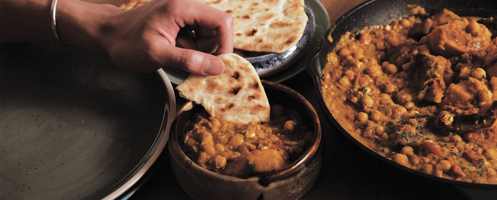

# ${1:IMD Fall 2021 - Final Integrated Project}

## About the Project
For the FIP, I create a 3-page cooking website in the topic of plant-based recipe. Kind Kitchen is the imaginary name of the website. The theme of the design is warming and minimalistic. In this website, you will find plant-based recipes and articles covering a wide range of subjects with photographys taken by myself. Enjoy!

## Contributing
1. Fork it!
2. Create your feature branch: `git checkout -b my-new-feature`
3. Commit your changes: `git commit -am 'Add some feature'`
4. Push to the branch: `git push origin my-new-feature`
5. Submit a pull request :D

## Credits
Joanna Chow

## License
MIT
